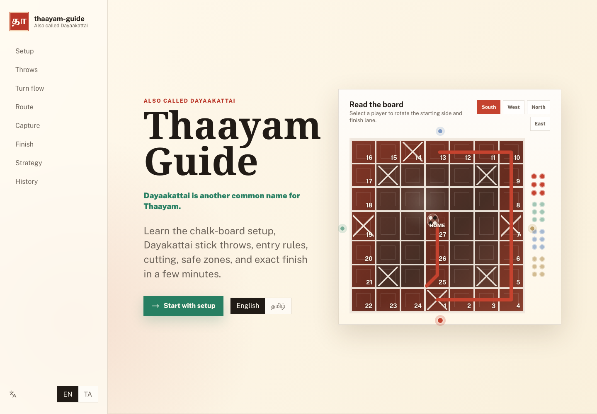
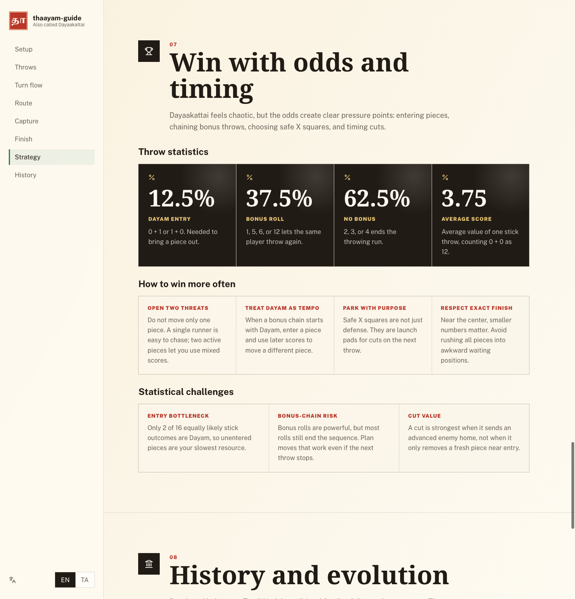
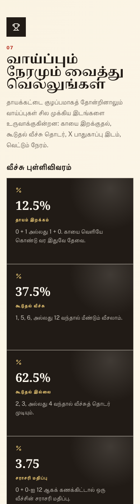

# thaayam-guide

A bilingual English and Tamil visual guide for the traditional Tamil game Thaayam, also known as Dayaakattai. The current flow follows the Dayakattai stick-dice version shown in the reference video.

Inspired by the visual, section-by-section teaching flow of [The Mahjong Guide](https://themahjong.guide/), adapted for Thaayam/Dayaakattai rules, board layout, and Tamil context.

## Screenshots







## Context kept

- Board: 7 x 7 Dayaakattai chalk layout with nine X safe squares.
- Languages: English and Tamil.
- Rules: stick throws, Dayam entry, bonus throws, route, cuts, safe zones, exact finish, strategy, and history.
- Sources: shared video context, Cyningstan Thaayam leaflet context, and Dayakattai stick-dice references. No external source links are rendered in the app because the Cyningstan HTTPS page refuses connections in some browsers.
- GitHub default branch: `main`.

## Run locally

```bash
npm install
npm run dev
```
